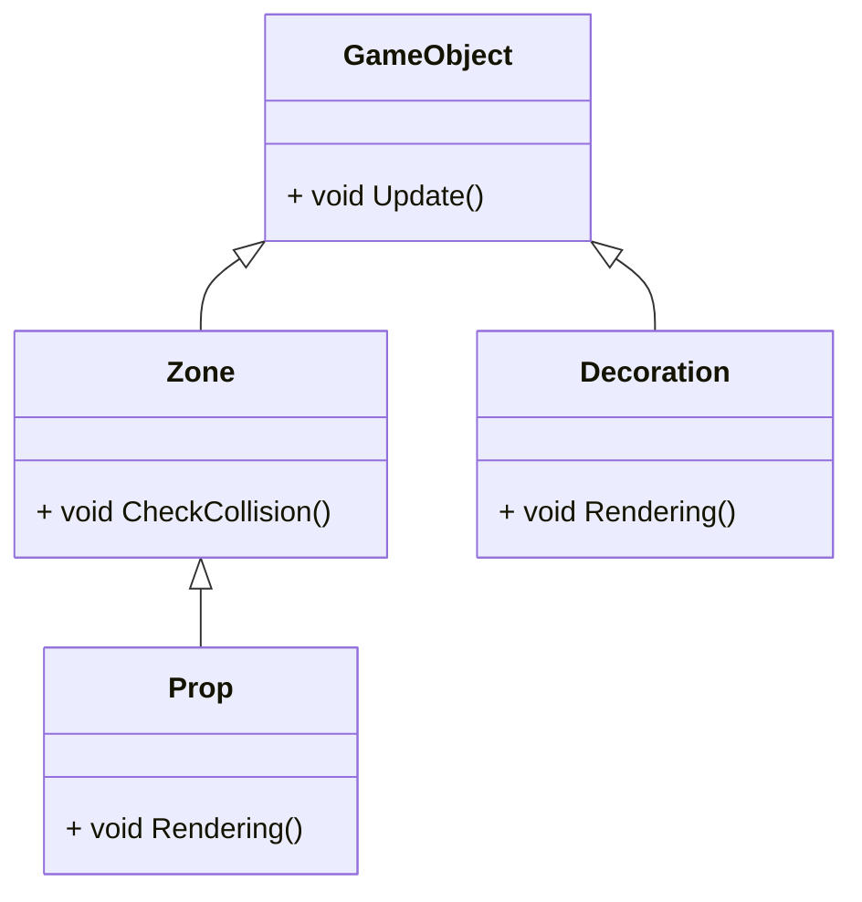
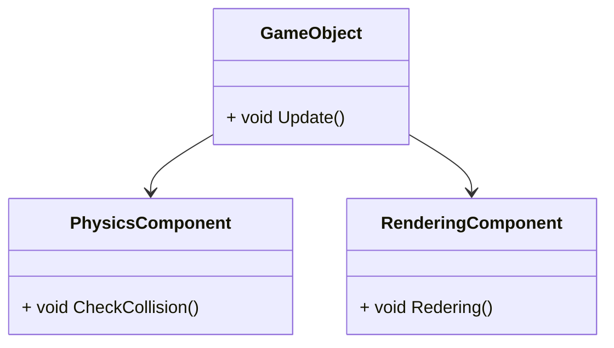

# Game Programming Patterns

## Unity以外で実装する必要性が出た時に読み返した方が良い章

- 3章、8章、9章、(11章)

## 1章　アーキテクチャ、実行速度、ゲーム

### 1.1

- 良いコードとは「部分的な変更があっても全体に影響を及ぼさない」コード
  - すなわち、変更が容易なコード

- 良いアーキテクチャとは、コードの変更に必要な知識を最小にするもの
  - すなわち、しっかり分離が行われているアーキテクチャ

### 1.2

- コンポーネントの分離にもコストがかかる
- また、分離を頑張りすぎると抽象レイヤーやインターフェースが多すぎて意味わからんくなる

### 1.3

- コードの柔軟性を上げると、実行速度が遅くなる
- しかし、柔軟なコードを早くするほうが、早いコードを柔軟にするより簡単なので、最初は柔軟に書いて、終盤にチューニングする方が良い

### 1.4

- アーキテクチャを考慮するのにもコストがかかるため、プロトタイピングではそこまでやる必要はない
  - ただし、そのコードがすぐに捨てられる事が条件
  - 本番のコードとして使いまわしてはいけない

### 1.6

- コードをきれいに保つ方法はコードを単純に保つこと

## 2章 コマンド

- コマンドとは、「メソッド呼び出しを具現化したもの」である
  - 具現化とは、クラスなどのオブジェクトにして変数に代入したり、関数の引数に渡したりできるようにすること

### 2.3
  
- Undo機能の実装について
  - Commandクラスに、excute()とundo()を実装することで、「処理を巻き戻す」が簡単に実装できるようになる

## 3章 フライウェイト

- GPUの描画負荷軽減について

## 4章 オブザーバ

- Rx系の使うパターン
- 発信者側は誰がどんな目的で使うか知らんけどとりあえず発信し続けてる
- オブザーバパターンを使うのにふさわしくない場面について
  - 受信者と送信者の両側を同時に考える必要がある場合は使うべきではない
    - 「物理演算」と「実績解除システム」のように、両者にほとんど関連がない場合は使っても良い
    - ModelとView(Actor)も同様か

## 5章 プロトタイプ

- Monsterクラスを継承したGhost、Demon、Sorcererクラスを作成する事を考える
- この時に、各クラスのFactoryクラス(GhostFactory、DemonFactory...)をそれぞれ作るのはアホらしい
- そのため、MonsterクラスにClone()メソッドを実装し、FactoryクラスはコンストラクタでプレハブとなるMonsterインスタンスを渡してもらう
  - インスタンスを生成する時は、渡されたプレハブのClone()を呼び出す
  - 適切なプレハブを用意すれば、同じクラスでも様々なタイプのオブジェクトを生成できる(素早いゴースト、タフなゴーストなど)

```c#
public abstract Monster{
  public abstract Monster Clone();
}

public class Ghost : Monster{
  private int _health;
  private float _speed;

  public Ghost(int health,float speed){
    _health = health;
    _speed = speed;
  }

  public override Monster Clone(){
    return new Ghost(_health,_speed);
  }
}

public class MonsterFactory{
  private Monster _prefab;
  public MonsterFactory(Monster prefab){
    _prefab = prefab;
  }

  public Monster Create(){
    return _prefab.Clone();
  }
}
```

- しかし、この方法にも欠点が多い
  - 各クラスにClone()を実装するのでは、結局コード量が変わっていない
  - 浅いコピーと深いコピーのどっちをするの問題
    - 例えば、Ghostクラスが槍を持っていた場合、それは複製するの、しないの

- 別のFactoryクラスとして、ジェネリッククラスを使う手法もある
  - ただ、この方法だとGhostのコンストラクタに値を代入できなくない？

```c#
public abstract Monster{
}

public class Ghost : Monster{
  public Ghost(){
  }
}

public class Factory<T> where T : Monster{
  public Monster Create(){
    return new T();
  }
}
```

- 関数ポインタを使う方法もある
  
```c#
public abstract Monster{
}

public class Ghost : Monster{
  private int _health;
  private float _speed;

  public Ghost(int health,float speed){
    _health = health;
    _speed = speed;
  }
}

public class Factory{
  private Func<Monster> _spawnFunc;

  public Factory(Func<Monster> spawnFunc){
    _spawnFunc = spawnFunc;
  }

  public Monster Create(){
    return _spawnFunc?.Invoke();
  }
}

public class User{
  private Factory _fasterGhostFactory;
  private Factory _toughGhostFactory;
  public User(){
   _fastGhostFactory = new Factory(()=>new Ghost(15,30f));
   _toughGhostFactory = new Factory(()=>new Ghost(50,5f));
  }

  private void Hoge(){
    //ゴーストをそれぞれ10体ずつ作成
    for(int i=0;i<10;i++){
      var fasterGhost = _fasterGhostFactory.Create();
      var toughGhost = _toughGhostFactory.Create();
    }
  }
}
```

- いずれの場合においても、これだけだと何の意味もない
  - Factoryクラス内で共通の作業(ゲームループへの登録など)を行ってこそ真価を発揮する

## 6章 シングルトン

- シングルトンはクラスによりカプセル化されたグローバル変数
  - それはそう

### 6.4

- Managerクラスとしてのシングルトンをむやみに作ってはいけない
  - BulletManagerの例
  - 自分でできることは自分でやらせる
    - 自分でできない事(インスタンスが知り得ない外部環境を使って次の行動を決定するなど)は、サービスクラスを使えば良いのではないか？

### シングルトンの代替案

- 引数渡し
  - 古典的だが、有効な事もある
  - メソッドの処理そのものに関連が全くないのならば別の方法を考える必要があるが、そうでないならばこれで良い
- 基底クラスに持たせる
  - 例えば、Player、Enemy、Bulletの基底クラスEntityに、ログ出力を行うためのクラスLogを、protectedで持たせる
    - では次に、どうやってEntityにLogのインスタンスを渡すのか、という話になるが、その解決策として、「参照を渡すための初期化関数を用意する」「サービスロケータ(16章参照)を使う」などがある
- シングルトンをまとめ上げるシングルトンを作る
  - SoudnManager、LogManagerを、それぞれ別々のシングルトンにするのではなく、一個のシングルトンGameのフィールド変数にする

## 7章　Stateパターン

- アクションゲームなどで、複雑な状態遷移をフラグで管理するのは不可能
  - そこでStateパターンを使う

- Stateパターンに入口処理と出口処理を追加する
  - Stateの切り替え時に、前のStateの出口処理と後のStateの入口処理を呼び出す

- 単純なStateパターンでは、並列状態機械を作りにくい
  - 「銃を持つ」「剣を持つ」「ジャンプする」「かがむ」という動作ができるPlayerを考える
  - 実際には、「銃を持ちながらジャンプする」「剣を持ちながらジャンプする」など、Stateは動作の組み合わせになり、その総数は動作が増えるに従って爆発的に増加する
  - 解決策として、2つの状態機構を並列に動作させる
    - 今回の例では、「動作用State機構」と「所持武器用State機構」を用意し、別々のサイクルで回す
    - この方法は、2つの機構が独立ならばうまく動作する
    - しかし実際には、「ジャンプ中は発砲できない」など相互に関連しあう事がほとんど
    - その場合は、if文相方の状態をチェックするなどで対処するしかない

- 階層的状態機械について
  - Stateは、親State、子Stateを定義する事が可能
  - Updateで、自分で処理できない部分は親Stateに処理を任せてしまう
    - 継承したメソッドのオーバーライドに似ている

- プッシュダウンオートマトン
  - 普通のオートマトンだと、遷移前の状況を知らない
  - 一方こちらでは、遷移前の状態に戻ることができる
  - 実装する動作は、「新しいStateをpushして遷移する」「現在のStateをpopして前の状態に遷移する」の2つ

## 8章 ダブルバッファ

- 低レイヤーでのグラフィック処理について
- 書き込み用、読み込み用のバッファを作り、片方が読み込みをやっている間にもう片方が書き込むを行うようにする

## 9章 ゲームループ

- 基本的なゲームループ

```c
while(true){
  processInput(); //前回呼び出された以降に生じた入力の処理
  update(); //モデルの更新処理
  render(); //描画処理
}
```

## 10章 更新メソッド

- コードのアーキテクチャを説明するのに、「詰め込まれた」という言葉が相応しく感じるならば、そのコードには問題が生じている可能性が高い

### リストの更新作業中に追加・削除を行う

- 追加
  - 一番末尾に追加すれば一般的には問題ない
  - 追加したフレーム中に更新したくない場合は、更新開始時の要素数のみを更新対象にするようにすれば良い

```c#
private List<Entity> _targets; //更新対象となるリスト

//毎フレーム呼ばれる関数
public void Update(){
  var targetNum = _targets.Count;
  for(int i=0;i<_targetNum;i++>){
    _targets[i].Update();

    ...

    //リストに追加
    var entity = new Entity();
    _targets.Add(entity;)
  }
}
```

- 削除
  - for文を回している最中には削除せず、チェックフラグだけ立てておき、回し終わった後に削除する

```c#
private List<Entity> _targets;

public void Update(){
  var deleteList = new List<Entity>();
  foreach(var entity in _targets){
    if(entity.IsDelete()){
      //削除フラグをたてる
      deleteList.Add(entity);
    }
  }

  //ループを回し終わった後に、フラグがついているもののみをまとめて削除する
  foreach(var entity in deleteList){
    _targets.Remove(entity);
  }
}
```

## 11章 バイトコード

- ユーザーがMOD開発できるようにするためには、ゲームをコンパイルするための仕組みが必要である
  - しかし、ゲームのコンパイラそのままは渡したくない
  - そのために、インタープリタパターンを使ってみる
    - めちゃくちゃ重い
  - だから、自前で機械語(らしきもの)を翻訳するVMを作ろう

- VMを作るために必要な命令の一例
  - 外部基本命令
    - 自作VMの外側、すなわちUnityやC++などで実装される命令を呼び出す命令
  - 内部基本命令
    - 自作VM内部の命令を呼び出す命令
    - リテラル(変数を定義できるようにするなど)、算術演算、比較演算、スタック操作など
  - フロー制御命令
    - if文、while文など
    - もっと抽象的に言うなれば、goto文
      - これさえあればif文でもwhile文でもfor文でも実装できる
  - 抽象化
    - 呼び出し可能な関数の実装など

## 12章 サブクラスサンドボックス

- Superpowerクラスを継承した、多数の超能力クラスを作る場合を考える
- 一つの基底クラスに対して、大量の具象クラスが作られる
  - その際に、以下の理由によりやばい実装になりがち
    - 具象クラスが外部と結合を持ち始める
    - 重複したコードが生まれ始める
  - そのため、外部と結合する役割を基底クラスに限定させて、具象クラスは基底クラス以外と結合しないようにする(べき)
    - でも、この方法はリスコフの置換原則に違反してないか？
    - 基底クラスの参照がやばいことにならないか？
      - 基底クラスに向かう矢印も多いし、基底クラスから向かう矢印も多い上(神クラス)

- 実際にこのようなケースに陥ったら、データ駆動方式を採用するのが一般的
  - 振る舞いをデータで実装する
  - 型オブジェクト(13章)、バイトコード(11章)、インタープリタなどのパターンが役立つ

## 13章 型オブジェクト

- 12章のように、基底クラスを具象化する際にサブクラスを作るのではなく、単一のクラスを使う方法
  - 攻撃力、HPなどのデータを別のクラスに移し、それらのインスタンスを複数作ることでバリエーションを持たせる
  - この欠点として、メソッドを持てない(ビヘイビアを定義できない)点がある
    - 解決策1: あらかじめ複数のビヘイビアを定義しておき、そのどれに該当するかをEnumなどで選択させる
    - 解決策2: ビヘイビアを11章のバイトコードなどで記述する

## 14章 コンポーネント

- よく言われる「差分プログラミングがしたいだけだったら継承ではなく移譲を使え」

- 例えば、以下はよくない



- 以下のようにするべき



- 上のようにすると、ZoneはPhysicsComponentを、DecorationはRederingComponentを、Propは両方を持つGameObjectとして生成すれば良いだけになる

- コンポーネント間の通信について
  - AIコンポーネントで決めた行き先にMoveコンポーネントが向かうなど、コンポーネントは相互作用できるようにする必要がある
  - 方法は3つある
    - コンポーネントを取りまとめるクラスの変数を書き換える
      - 一番単純な方法
      - PositionやScaleなど、みんな知っていて当然な物はこれの方が良いかも
      - 実際には、直接親を参照するより、データクラス的な物を作った方が良いかも
    - どちらかがもう片方を参照する
      - 例えば、AIコンポーネントがMoveコンポーネントを参照して、次の行き先を指定し続けるなど
    - メッセージを送る
      - p.252参照

## 15章 イベントキュー

- オブザーバーパターンの非同期版
- チュートリアルとかに使っても良いかも

## 16章 サービスロケータ

- サウンド出力機構のような、どこからでも呼び出せるようにしたいコンポーネントはシングルトンにする
  - しかし、シングルトンクラスは具象クラスであり、それを直接公開するのは事故の元
  - そこで**サービスロケータ**使う

- これを使えば、ゲーム起動中にサービスの変更ができる
  - チュートリアル中の間は走って欲しくない処理をNullObjectにする事とかもできそう

- 具象クラスの割り当てについて

- 案1
  - プラットフォーム依存コンパイルを
  - 高速な代わりに起動時に切り替えられない

```c#
public class Locator{
#if UNITY_DEBUG
  public static DebugService service;
#else
  public static NormalService service;
#endif
}
```

- 案2
  - 初期化時に設定する
    - 起動時に切り替えられる
    - 複雑

```c#
public class Locator{
  public static Service serice;

  public static void Initialize(Service newService){
    service = newService;
  }
}

public class Initializer{
  public static void main(int args, int[] argv){
    Locator.Initialize(new NormalService());
  }
}
```

- [参考](https://qiita.com/ozaki_shinya/items/9eb0f827caa6a4108888)

## 17章 データ局所化

- CPUは、あるメモリの内容が必要になったら、その後ろもまとめてfetchしてくる性質を持つ

